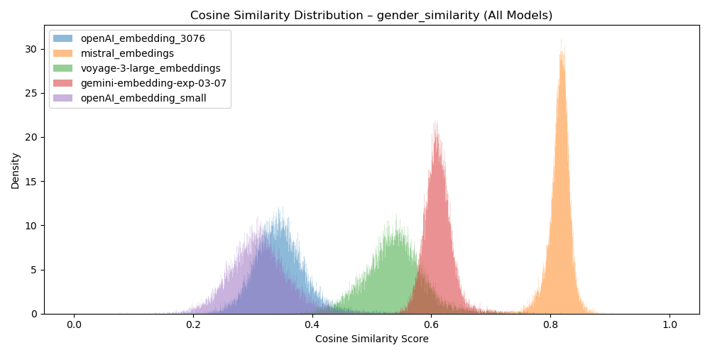

# LLM SLOVAK Benchmark

The aim of the project is to test LLM models and embedding models on the Slovak text corpus.
As a corpus for testing, I use transcripts from the session of the National Council of the Republic of Slovakia. They have two advantages:
1. Size - 75 million tokens according to cl100k_base from openAI
2. Structure and labeling. Each text has time, date, club, speaker and issue number (identifier of the law, the proposal being discussed) i.e. topic. The texts are thematic, significantly different in rhetorical style.

**Tested sample**
LLM models:
openAI: chat-gpt5, chat-gpt5 nano, chat-pgt5 mini
mistral:magistral-small-2507, "magistral-medium-2507", mistral-medium-2508
google: gemini-2.5-flash, gemmna family
Antrophic: claude-3-5-sonnet-20241022, haikul

Embedding models:
- openai: large and mini
- voyage: large
-cgemnini: -embedding-exp-03-07 note google changed the context window for this model from 8100 to 2000 and it is currently gemini-embedding-001/gemini
- mistral
- voyage: voyage large

**Executive summary**
I tested the embedding models with anomaly detection, semantic search by paraphrasing, question and literal statement, cluster task and whether the embedding models can identify not only topic, but also attitude.

With LLM models, I tested sentiment and the ability to recognize whether the text supports or does not support a given narrative.

The result is also an AI workflow - **"AI politico"**, which iteratively samples from a vector database to map changes in narratives to a topic and creates a largely complete set of narratives to a topic.

The result is also **Automated determination of semantic threshold** when using embedding models, there is always a question of what specific cosine score when it is possible to consider a text as semantically similar and when not. Based on iteratively adding text ascending and calculating the decrease calinski_harabasz or avg_intra_cosine when the score drops sharply, we have a semantic threshold.

**Dataset**
# Corpus size

Period: 2010 - 2023
Number of tokens: 75 million
Number of words: 34 million
time: 5796 hours of recording
number of records: 90373
source: https://www.nrsr.sk/web/

**basic attributes**
- klub: political club of the deputy
- Date: date of the deputy's speech
- schodza: number of the meeting in the election period
- prepis: text transcript of the debate
- tlac: print number - identifier of the bill being discussed
- druh vystúpenia: whether the speech is in the debate (longer), or a factual note on the speech in the debate
- poslanec: name of the deputy
- obdobie: This is the election period in which the speech is given
- Prekladateľ: name of the deputies, or the ministry that is translating the law - proxy for the topic
- 'openAI_embedding_3076': embedding vector of the transcript dim: 3072, context window: 8100
- 'voyage-3-large_embeddings', : embedding vector transcript dim: 2048 context window
- 'gemini-embedding-exp-03-07',: embedding vector transcript dim: 3072 context window
- 'openAI_embedding_small',: embedding vector transcript dim: 1536 context window: 8100
- 'mistral_embedings',: embedding vector transcript dim: 1024 context window

**Procedure and results**

Here I present a brief summary of the procedure and results of the single notebooks.

## 1.clean_semantically_speeches_final.ipynb

For clustering and anomaly detection tasks, it was necessary to clean the texts from semantically irrelevant texts, such as the chairman's statement, organizational statements, voting statements, etc. To identify anomalies, I used ECOD, KNN OTHER on embeddings, with the labeled texts I personally checked. Anomalies were identified within the framework of topics submitted by the ministry.

## 2.anomaly_detection_final.ipynb

I created pairs from individual topics, where 3% of the basic number from another topic was inserted into one. The task was to detect anomalies using these anomaly classifiers on embedding vectors. The F1 result is the average for all thematic pairs.

The average F1 value across embedding models corresponds to expectations, although I expected healthcare and culture to be semantically better separable.

## 3.embeddings_effectivity_final.ipynb

I tested 2 clustering efficiency tasks. 1. if we have a predetermined number of clusters (number of submitters) 2. Using elbow method on siluhote score to determine the optimal number of clusters.
| Embedding                  | Mode  | k_used | Precision | Recall | F1    | V-Measure | ARI   |
|-----------------------------|-------|--------|-----------|--------|-------|-----------|-------|
| gemini-embedding-exp-03-07  | elbow | 15     | 0.817     | 0.725  | 0.741 | 0.667     | 0.503 |
| gemini-embedding-exp-03-07  | fixed | 11     | 0.619     | 0.656  | 0.617 | 0.586     | 0.409 |
| voyage-3-large_embeddings   | elbow | 13     | 0.759     | 0.716  | 0.718 | 0.631     | 0.433 |
| voyage-3-large_embeddings   | fixed | 11     | 0.664     | 0.673  | 0.663 | 0.632     | 0.479 |
| openAI_embedding_3076       | elbow | 11     | 0.672     | 0.599  | 0.600 | 0.523     | 0.340 |
| openAI_embedding_3076       | fixed | 11     | 0.672     | 0.599  | 0.600 | 0.523     | 0.340 |
| openAI_embedding_small      | elbow | 2      | 0.033     | 0.148  | 0.054 | 0.054     | 0.019 |
| openAI_embedding_small      | fixed | 11     | 0.410     | 0.484  | 0.422 | 0.427     | 0.243 |
| mistral_embedings           | elbow | 15     | 0.692     | 0.674  | 0.662 | 0.638     | 0.434 |
| mistral_embedings           | fixed | 11     | 0.631     | 0.649  | 0.627 | 0.593     | 0.407 |

Thematic structure of the cluster gemini elbow

Thematic structure of the cluster gemini fixed

## 4.embeddings_effectivity_final_to_eng.ipynb

The same task, only how will it affect the results when the texts are translated into English, used google cloud traslate for translation, but all metrics decreased.

| Embedding | Fashion | k_used | Precision | Recall | F1 | V-Measure | ARI |
|----------------------------------|-------|--------|-----------|--------|-------|----------|-------|
| gemini-embedding-exp-03-07_eng | elbow | 14 | 0.681 | 0.669 | 0.669 | 0.574 | 0.382 |
| gemini-embedding-exp-03-07_eng | fixed | 11 | 0.568 | 0.610 | 0.581 | 0.555 | 0.364 |
| openAI_embedding_3076_eng | elbow | 2 | 0.029 | 0.121 | 0.045 | 0.035 | 0.011 |
| openAI_embedding_3076_eng | fixed | 11 | 0.551 | 0.543 | 0.526 | 0.500 | 0.320 |
| openAI_embedding_small_eng | elbow | 2 | 0.034 | 0.152 | 0.055 | 0.065 | 0.026 |
| openAI_embedding_small_eng | fixed | 11 | 0.550 | 0.472 | 0.457 | 0.401 | 0.189 |
| mistral_embeddings_eng | elbow | 15 | 0.635 | 0.635 | 0.607 | 0.600 | 0.382 |
| mistral_embeddings_eng | fixed | 11 | 0.553 | 0.603 | 0.557 | 0.536 | 0.359 |
| voyage-3-large_embeddings_eng | elbow | 15 | 0.785 | 0.730 | 0.741 | 0.637 | 0.427 |
| voyage-3-large_embeddings_eng | fixed | 11 | 0.533 | 0.548 | 0.513 | 0.530 | 0.314 |

## 5.semantic_search_final.ipynb

I tested the effectiveness of cosine similarity search. On a sample of 500 texts from NRSR (presented in the debate for longer context). LLM was given the task
to extract a literal sentence from the texts, paraphrase part of the text, or create a question based on the text. These were embedded and based on the cosine similarity
between the derived text and the primary text and the order in which it appeared I measured the following metrics: recall@1 precision@1 mrr@1 ndcg@1 recall@5 precision@5 mrr@5 ndcg@5 recall@10 precision@10

Results for recall@5

**Literal sentence**

**Paraphrase**

**Question**

## 6.cosine_score_treshold_final.ipynb

My goal was and still is to quantify the semantic threshold for SVK Embeddings automatically for various embedding models.
For this purpose, I created 3 basic narratives with which I will continue to work: Pro-Russian, Anti-vaccination, Anti-gender. The reason for their selection is their clear political definition and frequency in the studied period. I embedded these narratives with models.

Methodology for determining the "semantic threshold". The procedure is based on iterative cluster creation. If the texts are semantically similar, their cluster should have a high metric value (Silhouette Score, Calinski-Harabasz Index etc. ), if the cluster value decreases, we know that the texts are no longer similar.
I sorted the texts in descending order by cosine score. After 50 texts, I created clusters. Cluster 1 was for the 50 highest scores, cluster 2 was for the 100 highest scores, etc.
For the breakpoint in quality, I used pwlf - Piecewise Linear Fit. I use a 2-segment fit to find the elbow/knee of a metric curve and take the breakpoint index as the threshold.

It is necessary to say that the method still needs a little tuning. The models in the set agree with each other, but the head is in the highest quartile (highest score), at the same time when manually labeling the bottom 2 for each model it was seen that they thematically loosened up and were just ahead of the rake, or behind it.

## 7.stance_emmbedings_final.ipynb

All narratives were discussed during the 8th election cycle. The clubs but have different stance to narratives. So the hypothesis is if the embeddings models know to distinguish between stace, the distributions of clubs, which have same stance as we define shoudl be in the "above the threshold" and particular quartiles different.

## 8.sentiment_predkladatel_efectivity_final.ipynb

To measure sentiment I have chosen the following methodology. If the proposer is the government, then the deputies from the opposition clubs criticize the proposal. To measure sentiment I have therefore used the statements of the deputies from the opposition against the government proposals.

## 9.stance_LLM_research_final.ipynb

To distinguish the stance, i.e. whether we are defending pro-vaccination theses, or whether the speaker supports pro-Russian arguments, I used the following methodology. Based on **cosine_score_treshold_final** I identified texts with a present narrative (agreement of 4 out of 5 models), then I used deputies from clubs whose stance is certain as a label.

## 10.AI_agent_politico_final.ipynb

The goal is to create a full set of statements from a number of statements n that covers the semantic space in the given text corpus and the statements in the set are complementary but do not semantically overlap. By iteratively incorporating newly discovered narratives and recomputing cosine similarities, we progressively expand the topic’s semantic space through targeted sampling and reliable identification of additional narratives.

*Methodology:*
1. Basic corpus - embedded and creating cosine similarity score with individual texts
2. Sampling texts from df
3. Extracts sentences that relate to the topic and attitude, but which are not yet identified by LLM 
4. LLM categorizes sentences into thematic groups
5. Samples from a new thematic group from the cosine score closer to the semantic threshold to grab frontier texts
6. Repetition to 1
7. End after fixed after end, or the number of newly added sentences will not be sufficient

Input:
pro_russian_queries = [
"Nerobme z Ruska nášho nepriatela Rusko nie je náš nepriateľ.",
    "Rusko vyprokovalo rozširovanie do NATO. Rusko nikdy nedovolí,  aby Ukrajina bola v NATO",
    "Dodavanim zbrani ten konflit len predlžujme.Ak budeme posielat zbrane tak ten konflikt predlžime a viac ľudí bude umierať",
    "Všetci len strašite Ruskom, že Rusko je zle. Ale čo Irak a Juhoslavia čo bombardovali Američania a USA. Prečo ste boli vtedy ticho? ",
    "Sankciami poškudzujeme len seba. Rusko sankciami vobec netrpi. Bez ruskeho plynu to pomrzneme "
]

Output:
- rusko-nie-je-hrozba-ani-nepriatel: 15 relevant texts
- nato-provokuje-rozsirovanie-ukrajina: 7 relevant texts
- proti-dodavkam-zbrani-za-mier: 11 relevant texts
- sankcie-a-energia-skodia-nam: 17 relevant texts
- rusko-neporazitelna-jadrova-mocnost: 0 relevant texts
- krym-sebaurcenie-a-trvalost: 16 relevant texts
- dobre-vztahy-s-ruskom: 85 relevant texts
- whataboutizmus-irak-juhoslavia: 1 relevant texts
- zapad-proxy-vojna-a-propaganda: 41 relevant texts
- historicka-vdacnost-sssr-a-slovania: 9 relevant texts

Total file:
[Final_russian_narratives](final_analysis_gpt-5_russian.md)

## 11.analysis\politico_analytic.ipynb
*Visualization of selected talking points*

## Conclusion
When applying embedding models, I would recommend the gemini model, as it has a smaller context window (2,048 tokens), the version I used had 8100 tokens. If the context window is a problem, I would use voyage.

With LLM, it can be seen that the results of the models were the same for sentiment and stance detection models. Open source models and smaller models lose their breath when using SVK text, which can be limiting for their deployment. In the future, I will extend the test to other open source models.

## Using llm models at work
When programming, Copilot was my assistant, and when it came to the correct form and good English grammar for markdown, chat-gpt-5 was my companion.

@article{dobrolubov2025slovakllm,
title={Slovak LLM Benchmark},
author={Dobroľubov, Alexej},
year={2025},
url={https://github.com/jexela/LLM-SLOVAK-Benchmark}
}
